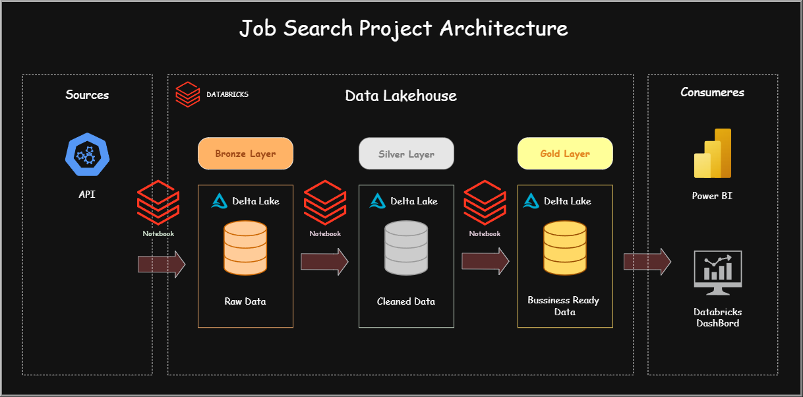
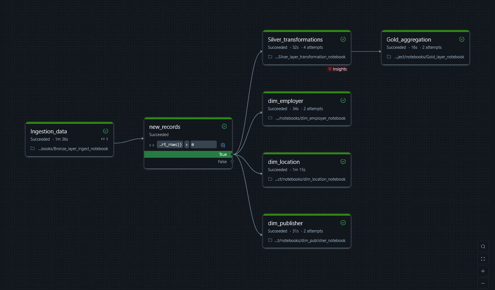

# Job Seach Pipeline 🚀

## Overview

**Job Search Project** is an end-to-end data engineering project that collects job postings from a Job Search API, processes and transforms the data using **Databricks + PySpark**, stores the results using **Delta Lake**, and generates analytics-ready datasets.

The goal of this project is to demonstrate a real-world data engineering workflow including API ingestion, ETL processing, data modeling, and analytics.

---

## Architecture
The pipeline follows a medaillon architecture implemented in Databricks, progressively transforming raw job -posinting data into clean, structured, and business-ready datasets.

The follonwing diagram provides an overview of the complete data flow, from API ingestion through the Bronze, Silver , and Gold layers to the final analaystics nad visualization consumers.




# Technologies Used
 ---------------------------------------------
| Technology  |  Purpose                     |
| ----------  |  --------------------------- |
| Databricks  |  Data processing platform    |
| PySpark     |  Data transformation         |
| Python      |  API ingestion and utilities |
| REST API    |  Job data source             |
| Delta Lake  |  Data storage                |
| SQL         |  Analytics queries           |
| GitHub      |  Version control             |
| Power BI    |  Data Visualisation          |
 ---------------------------------------------


# Project Structure

```
job_seach_project-pipeline/

│
|── src/
|    ├── defintion_tables/
|    |   ├── def_bronze_table.sql
|    |   ├── def_silver_table.sql
|    |   ├── def_gold_table.sql
|    |   ├── dim_job_employer_table.sql
|    |   ├── dim_job_location_table.sql
|    |   └── dim_job_publisher_table.sql
|    |   
|    ├── transformations/
|    │   ├── gold_transformationss.ipynb
|    │   ├── ingestion_transformations.ipynb
|    │   └── silver_transformations.ipynb
|    |
|    ├── utils/
|    │   ├── api_response.py
|    │   ├── config.py
|    │   ├── geo_location.py
|    │   └── spark_utils.py
|    │
|    └── sql/
|        ├── top_employers.sql
|        └── top_regions_per_offres.sql
│
├── notebooks/
|   ├── ingest_api_bronze_layer.ipynb
|   ├── clean_transform_data_silver_layer.ipynb
|   ├── analytics_golds_layer.ipynb
|   ├── dim_employer_notebook.ipynb
|   ├── dim_location_notebook.ipynb
|   └── dim_publisher_notebook.ipynb
|
├── docs/
│   └── architecture.png
|
├── dashbord/
│   ├── data_model.png
|   ├── View offres.png
|   └── View synthese.png
│
├── .gitignore
├── databricks.yaml
├── requirements.txt
└── README.md
```

---

# Data Pipeline


## 1. Data Ingestion ( Bronze Layer )

The ingestion process retrieves job postings from a REST API.

Collected information includes:

* Job title
* Company
* Location
* Job description
* Posting date
* Etc...

Raw API responses are stored without modification to preserve the original data.

Link to API : https://rapidapi.com/letscrape-6bRBa3QguO5/api/jsearch/playground/endpoint_23a56c32-02d3-45a2-94ab-fdda973f445c

---

## 2. Data Cleaning (Silver Layer)

The cleaning process applies data quality rules:

* Remove duplicate job postings
* Handle missing values
* Normalize locations
* Standardize job titles
* Convert dates

The output is a structured Delta table ready for analysis.

---

## 3. Analytics Layer (Gold Layer)

The Gold layer provides business-ready datasets organized using a star schema, enabling efficient analytical queries and reporting.

The model consists of:

* Fact tables — measurable business events/metrics, such as job postings and salary information.
* Dimension tables — descriptive attributes such as company, location, job title, publisher and date.

The star schema supports analytical use cases including:
Job Market Analysis

For example, analytical queries can be used to identify:
- Top company hiring 
- Top region hiring
- Top skills required

---

# Setup Instructions

## 1. Clone Repository

git clone https://github.com/oussama-elmaachy/job_search_project


---

## 2. Install Dependencies

```bash
pip install -r requirements.txt
```

---

## 3. Configure API Credentials

API keys should not be stored in the code.

Use Databricks Secrets:

```python
api_key = dbutils.secrets.get(
    scope="job-search-api",
    key="api-key"
)
```

---

## 4. Run the Pipeline

Execute notebooks in order:




---

# Data Quality Checks

The pipeline includes validation steps:

✅ Check missing values

✅ Remove duplicated records

✅ Validate required columns

✅ Verify API response structure

✅ Ensure correct data types

---

# Example Analytics Questions

The pipeline can answer questions such as:

* Which companies are hiring the most?
* Which locations have the highest number of opportunities?
* How does job demand evolve over time?

---

# Future Improvements

Possible improvements:

* Add automated Databricks Workflows
* Add CI/CD with GitHub Actions
* Add unit tests with PyTest
* Add data quality framework (Great Expectations)
* Add ML model to predict salary ranges

---

# Author

**Oussama EL MAACHY**

Data Engineering Portfolio Project

GitHub : https://github.com/oussama-elmaachy. LinkedIn : https://linkedin.com/in/oussama-elmaachy

---

# License

This project is for educational and portfolio purposes.
